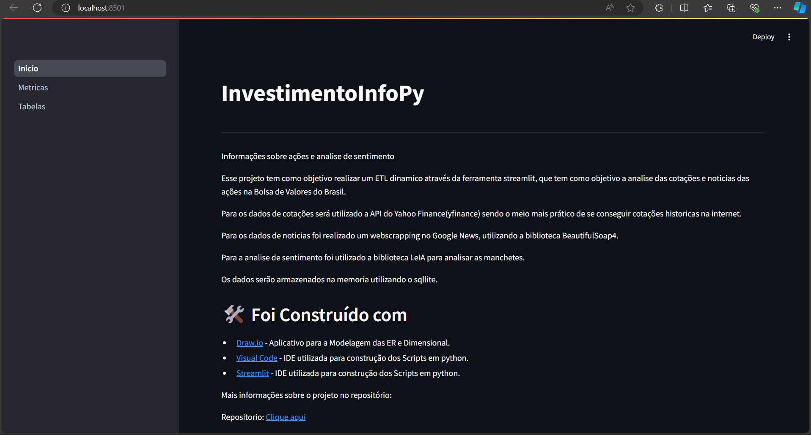
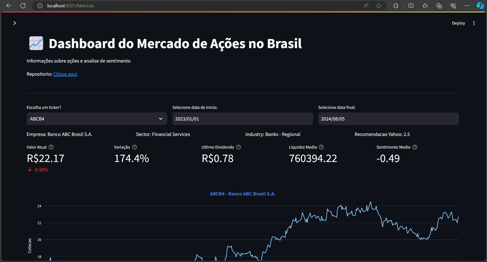
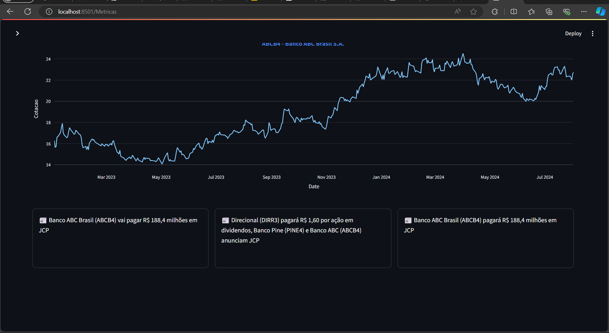
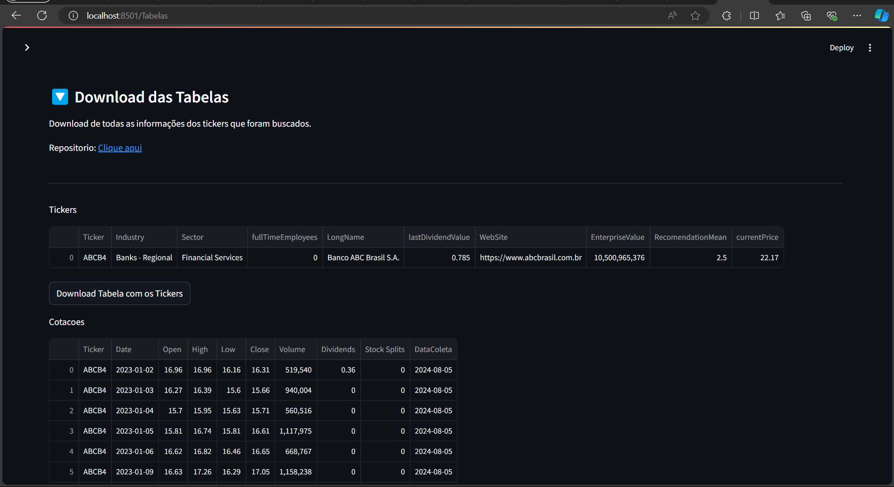

# InvestimentoInfoPy

Este projeto tem como objetivo realizar um ETL dinâmico através da ferramenta Streamlit, com o propósito de analisar as cotações e notícias das ações na Bolsa de Valores do Brasil.

Para os dados de cotações, será utilizada a API do Yahoo Finance (yfinance), sendo o meio mais prático de obter cotações históricas na internet.

Para os dados de notícias, foi realizado um web scraping no Google News, utilizando a biblioteca BeautifulSoup4.

Para a análise de sentimento, foi utilizada a biblioteca LeIA para analisar as manchetes.

Os dados serão armazenados na memória utilizando o SQLite.

Todo o scritp foi construido em uma maquina virtual linux 

# Tela Inicial: 

A tela inicial traz uma breve descrição do que é o projeto

# Metricas: 

Na tela de metricas temos alguns indicadores de valores das cotações, assim como uma analise de sentiment aplicada a noticias

Na tela abaixo pegamos 3 noticias aletorias

# Download das Tabelas:

No final de todo o processo você pode realizar o download em csv de toda busca realizada.

## 🛠️ Foi Construído com

* [Draw.io](https://app.diagrams.net/?mode=google) - Aplicativo para a Modelagem das ER e Dimensional.
* [Visual Code](https://code.visualstudio.com/download) - IDE utilizada para construção dos Scripts em python.
* [Streamlit](https://docs.streamlit.io/) - IDE utilizada para construção dos Scripts em python.

## Para execução será necessário

# Instalar o python na sua maquina:

    `apt install python3-pip`

# Instalar o venv para criar um ambiente:

    `sudo apt install python3-venv`

# Inicie o Ambiente Virtual:

    `python3 -m venv myenv
    source myenv/bin/activate`

# Instalar as bibliotecas: 

    `pip install streamlit bs4 pandas pandas_datareader datetime plotly requests_html LeIA yfinance investpy lxml[html_clean] leia-br`

# Instalação do banco de dados (Linux):

    `sudo apt update
     sudo apt install sqlite3`

# Execução do streamlit:

    Basta executar no terminal o comando `streamlit run Inicio.py` que o streamlit vai iniciar.